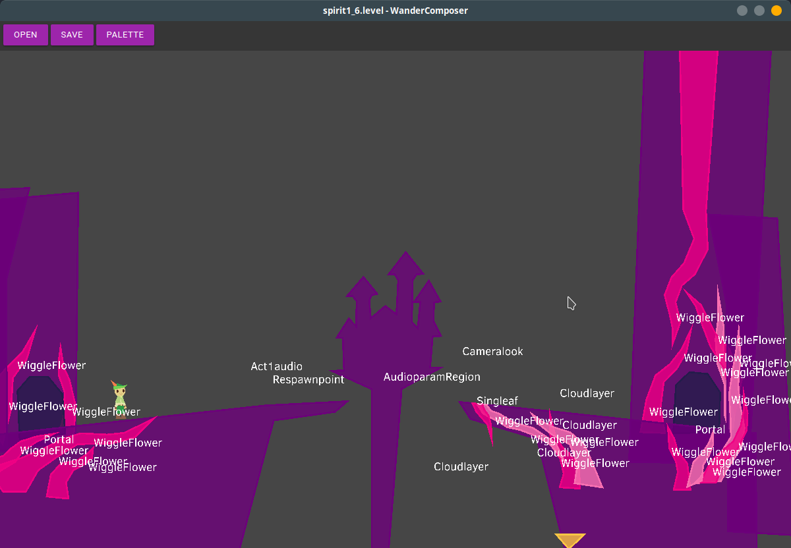
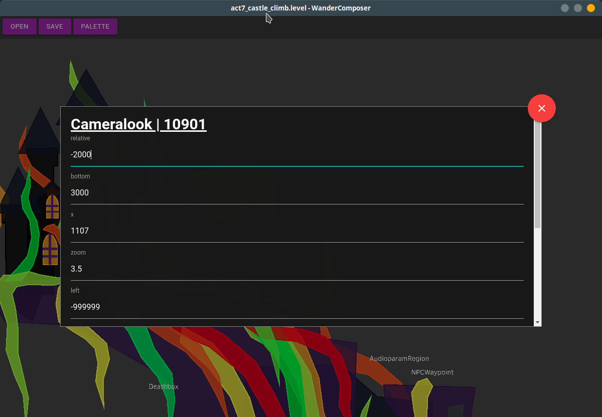
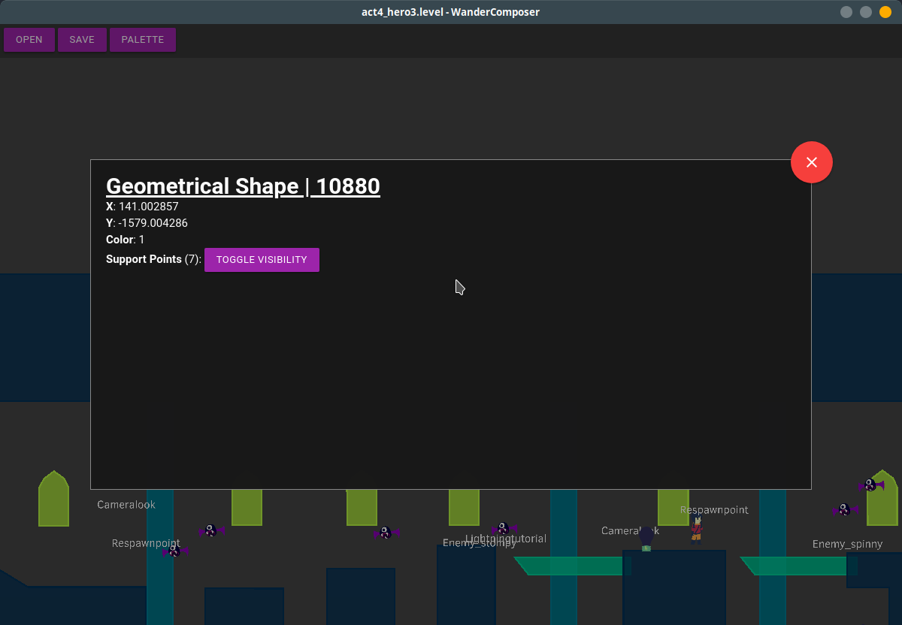

# WanderComposer
a level editor/viewer for wandersong

## Install
clone the repo to a folder
```
git clone https://github.com/thefoxbot/wandercomposer.git
```

install all the required dependencies
```
npm install
```

run it
```
npm start
```

## Usage
hold down and move mouse to move around the map

right click on an object/geometrical object to view and change its properties

## Screenshots







## Q&A

Q: Why electron???

A: i couldnt find anything better for this than electron and its already too late. im just too used to js to learn another language for this one program


TODO: finish this